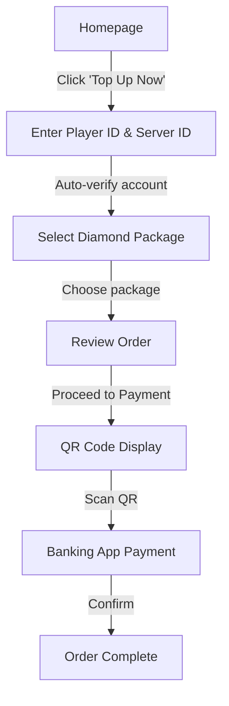
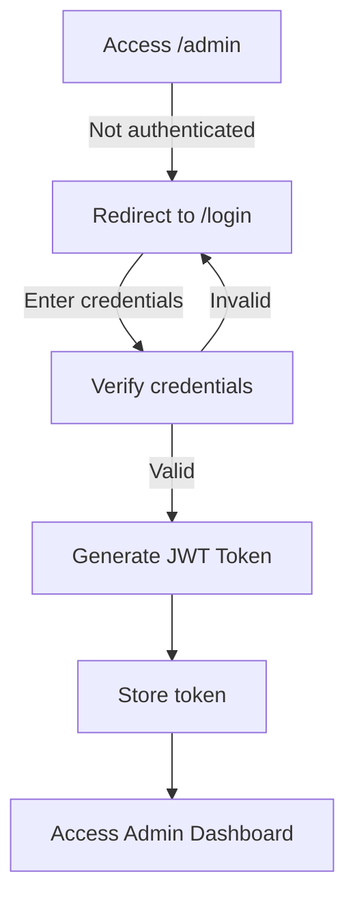

# 👥 User Roles & Permissions Summary

## Overview

The MLBB Top-Up application supports **two distinct user roles**:
1. **Guest Customers** - Can purchase diamonds without login
2. **Admin Users** - Manage orders and system (requires authentication)

---

## 🎮 Role 1: Guest Customer (Public)

### **Access Level: PUBLIC - No Authentication Required**

### **What Guest Customers Can Do:**

✅ **Browse Homepage**
- View all features
- See package offerings
- Read how-it-works guide

✅ **Top-Up Diamonds (Full Flow)**
- Access `/topup` directly without login
- Enter MLBB Player ID and Server ID
- Real-time account verification
- Select diamond package
- Review order details
- Generate KHQR payment QR code
- Complete payment in banking app
- Receive order confirmation

✅ **Smart Features**
- Auto-detect Player ID format (e.g., "1225368571 (11446)")
- Auto-extract Server ID from various formats
- View payment QR code immediately
- Auto-open banking app via deep link (mobile)

✅ **Support Access**
- Access support page
- View FAQ
- Contact information

### **What Guest Customers CANNOT Do:**

❌ View past order history (no account)  
❌ Save payment methods  
❌ Create user profile  
❌ Access admin features  
❌ View other users' orders  

### **Data Required from Guest:**

| Data | Required | Stored | Purpose |
|------|----------|--------|---------|
| **Player ID** | ✅ Yes | ✅ Yes | MLBB account identifier |
| **Server ID** | ✅ Yes | ✅ Yes | MLBB server/zone |
| **Package Selection** | ✅ Yes | ✅ Yes | Diamond amount |
| Email | ❌ No | ❌ No | Not required |
| Password | ❌ No | ❌ No | Not required |
| Phone | ❌ No | ❌ No | Not required |
| Name | ❌ No | ❌ No | Not required |

### **Guest Navigation**

```
┌─────────────────────────────────────┐
│  MLBB Top-Up                        │
│                                     │
│  [Home] [Top Up] [Support]         │
└─────────────────────────────────────┘
```

**No Login or Register buttons visible!**

### **Guest User Flow**



### **Guest Order Data Structure**

```json
{
  "orderId": "550e8400-e29b-41d4-a716-446655440000",
  "userId": null,  // ← Guest orders have no userId
  "playerID": "1225368571",
  "serverID": "11446",
  "productId": "abc123",
  "amount": 4.00,
  "paymentStatus": "Pending",
  "paymentMethod": "khqr",
  "khqrBillNumber": "MLBB000012",
  "createdAt": "2026-08-28T14:30:00Z"
}
```

---

## 👔 Role 2: Admin User (Protected)

### **Access Level: AUTHENTICATED - Requires Login**

### **What Admin Users Can Do:**

✅ **Authentication**
- Login with email/password
- JWT token-based session
- Secure password (BCrypt hashed)

✅ **Order Management**
- View all orders (guest + registered)
- Filter orders by status
- View payment details
- Track payment status
- Manual order verification
- View customer details

✅ **User Management**
- View registered users
- View user roles
- Manage admin accounts

✅ **Dashboard Access**
- Sales statistics
- Order analytics
- Revenue reports
- Popular packages

✅ **Product Management**
- Add/edit diamond packages
- Set pricing
- Enable/disable products
- View product performance

### **What Admin Users CANNOT Do:**

❌ View customer payment methods (security)  
❌ Access customer banking details  
❌ Modify completed orders  
❌ Delete transaction logs  

### **Admin Navigation**

```
┌─────────────────────────────────────────────────────┐
│  MLBB Top-Up                    Hello, Admin ▼      │
│                                                      │
│  [Home] [Top Up] [Support] [Admin] [Logout]        │
└─────────────────────────────────────────────────────┘
```

### **Admin Routes (Protected)**

| Route | Access | Purpose |
|-------|--------|---------|
| `/admin` | 🔒 Admin Only | Admin dashboard |
| `/admin/orders` | 🔒 Admin Only | Order management |
| `/admin/users` | 🔒 Admin Only | User management |
| `/admin/products` | 🔒 Admin Only | Product management |
| `/admin/reports` | 🔒 Admin Only | Analytics & reports |

### **Admin Authentication Flow**



---

## 🔒 Security Model

### **Guest Checkout Security**

| Aspect | Implementation |
|--------|----------------|
| **Order Creation** | `[AllowAnonymous]` attribute on controller |
| **Order ID** | UUID v4 (unique, non-guessable) |
| **Payment Tracking** | KHQR MD5 hash for status checks |
| **Data Validation** | Server-side validation of Player ID/Server ID |
| **Rate Limiting** | Prevent abuse (recommended) |

### **Admin Security**

| Aspect | Implementation |
|--------|----------------|
| **Authentication** | JWT Bearer tokens |
| **Password** | BCrypt hashed (salt + hash) |
| **Authorization** | `[Authorize(Roles = "Admin")]` attribute |
| **Token Expiry** | 60 minutes (configurable) |
| **HTTPS Only** | Production requires HTTPS |

### **Payment Security**

| Aspect | Implementation |
|--------|----------------|
| **Payment Gateway** | KHQR Bakong API (trusted) |
| **QR Generation** | Server-side only |
| **Transaction ID** | Unique MD5 hash tracking |
| **Webhook Verification** | Signature validation (future) |
| **No Card Storage** | No credit card data stored |

---

## 📊 Role Comparison

| Feature | Guest Customer | Admin User |
|---------|----------------|------------|
| **Access Homepage** | ✅ Yes | ✅ Yes |
| **Top-Up Diamonds** | ✅ Yes (without login) | ✅ Yes |
| **View QR Code** | ✅ Yes | ✅ Yes |
| **View Own Orders** | ❌ No (no account) | ✅ Yes |
| **View All Orders** | ❌ No | ✅ Yes |
| **Admin Dashboard** | ❌ No | ✅ Yes |
| **Product Management** | ❌ No | ✅ Yes |
| **User Management** | ❌ No | ✅ Yes |
| **Authentication Required** | ❌ No | ✅ Yes |
| **Navigation Options** | Home, Top Up, Support | Home, Top Up, Support, Admin |

---

## 🛠️ Implementation Details

### **Backend: OrdersController.cs**

```csharp
[ApiController]
[Route("api/[controller]")]
public class OrdersController : ControllerBase
{
    // ✅ GUEST ACCESS: Allow anonymous order creation
    [HttpPost]
    [AllowAnonymous]  // ← Allows guests to create orders
    public async Task<IActionResult> CreateOrder(
        [FromBody] CreateOrderRequest request)
    {
        var order = await _orderService.CreateOrder(
            userId: null,  // ← Guests have no userId
            playerID: request.PlayerID,
            serverID: request.ServerID,
            productId: request.ProductId
        );
        
        return Ok(order);
    }
    
    // 🔒 ADMIN ACCESS: Requires authentication
    [HttpGet]
    [Authorize(Roles = "Admin")]  // ← Admin only
    public async Task<IActionResult> GetAllOrders()
    {
        var orders = await _orderService.GetAllOrders();
        return Ok(orders);
    }
}
```

### **Frontend: Route Configuration**

```javascript
// App.js
<Routes>
  {/* PUBLIC ROUTES - No auth required */}
  <Route path="/" element={<Home />} />
  <Route path="/topup" element={<TopUp />} />  {/* ← Guest access */}
  <Route path="/support" element={<Support />} />
  
  {/* PROTECTED ROUTES - Auth required */}
  <Route path="/admin" element={
    <AdminRoute>  {/* ← Redirects to /login if not admin */}
      <AdminDashboard />
    </AdminRoute>
  } />
</Routes>
```

### **Frontend: Navigation Logic**

```javascript
// Navbar.js
{isAuthenticated() ? (
  // Show admin options
  <div>
    <Link to="/admin">Admin</Link>
    <button onClick={logout}>Logout</button>
  </div>
) : (
  // Hide login/register for guests
  null  // ← No login buttons shown
)}
```

---

## 📈 Business Logic

### **Order Creation Logic**

```
IF user is authenticated (admin):
  ├─ Associate order with userId
  ├─ Add to user's order history
  └─ User can view in dashboard

ELSE user is guest:
  ├─ Create order with userId = null
  ├─ Guest gets Order ID
  ├─ Can track via Order ID (future)
  └─ No persistent history
```

### **Payment Processing**

```
1. Guest creates order
   ↓
2. System generates KHQR payment
   ├─ Bill number: MLBB{OrderId}
   ├─ QR code generated
   └─ Deep link created
   ↓
3. Guest scans QR
   ↓
4. Banking app processes payment
   ↓
5. KHQR webhook confirms (future)
   ↓
6. Diamonds delivered to Player ID
```

---

## 🎯 User Journey Comparison

### **Guest Customer Journey**

```
1. Homepage
   ↓
2. Click "Top Up Now"
   ↓
3. Enter Player ID & Server ID
   ↓
4. Select Package
   ↓
5. Review Order
   ↓
6. QR Code Display
   ↓
7. Banking App Opens (auto)
   ↓
8. Scan & Pay
   ↓
9. Done! (No account needed)

⏱️ Time: ~2 minutes
🔐 Login: Not required
```

### **Admin User Journey**

```
1. Access /admin URL
   ↓
2. Redirected to /login
   ↓
3. Enter email & password
   ↓
4. JWT token issued
   ↓
5. Admin Dashboard
   ↓
6. View all orders
   ↓
7. Manage system

⏱️ Time: ~1 minute (after login)
🔐 Login: Required
```

---

## ✅ Testing Scenarios

### **Test Guest Checkout**

```bash
# 1. Access without login
GET http://localhost:3001/topup
Expected: Page loads without redirect

# 2. Create order
POST http://localhost:5000/api/orders
Body: {
  "playerID": "1225368571",
  "serverID": "11446",
  "productId": "abc123"
}
Expected: Order created with userId = null

# 3. Verify no auth required
Headers: No Authorization header
Expected: Success
```

### **Test Admin Access**

```bash
# 1. Access admin without login
GET http://localhost:3001/admin
Expected: Redirected to /login

# 2. Login
POST http://localhost:5000/api/auth/login
Body: {
  "email": "admin@example.com",
  "password": "password123"
}
Expected: JWT token returned

# 3. Access admin with token
GET http://localhost:5000/api/admin/orders
Headers: Authorization: Bearer {token}
Expected: All orders returned
```

---

## 📝 Summary

### **Key Points**

1. ✅ **Customers DON'T need accounts** - Guest checkout enabled
2. ✅ **Admins DO need accounts** - Protected dashboard
3. ✅ **Two separate flows** - Public (guest) vs Private (admin)
4. ✅ **Security maintained** - Admin features fully protected
5. ✅ **Simplified UX** - No login buttons for customers

### **Role Distribution**

- **99% of users**: Guest customers (no auth)
- **1% of users**: Admin staff (authenticated)

### **Benefits**

- 🚀 **Faster checkout** - No registration friction
- 💰 **Higher conversion** - Fewer steps to purchase
- 🔒 **Still secure** - Admin features protected
- 📊 **Trackable** - Orders tracked by Order ID

---

**Made with ❤️ for seamless customer experience**

*Last Updated: August 28, 2026*
